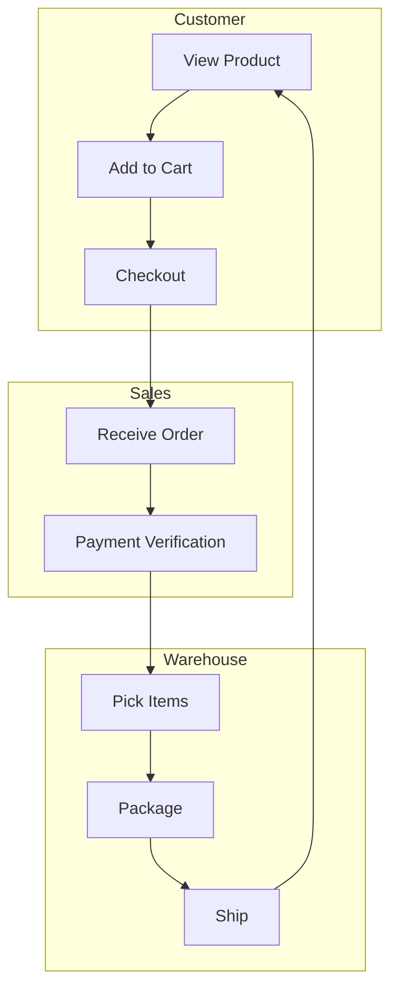
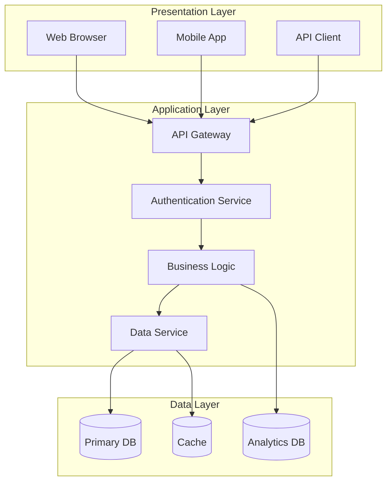
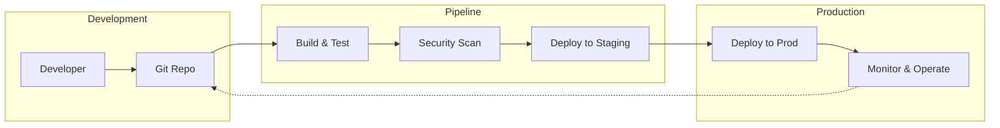

## generate a diagram by provided information

**Supported Diagram Type**

### 1. Business Architecture
**Visuals:** A "block" or "grid" layout. Top-level blocks represent high-level business domains (e.g., Finance, Operations). Sub-blocks underneath show specific capabilities (e.g., Accounts Payable).
**Look:** It feels like a high-level floor plan of a company's functions, often using color coding to show maturity or strategic importance.
**Sample** references/diagram/screens/business-architecture*.*

### 2. Data Architecture
**Visuals:** Cylinders represent databases; rectangles represent systems or processes. Arrows indicate the movement of data.
**Look:** It looks like a "plumbing" diagram, showing where data is stored, where it is transformed, and who consumes it.
**Sample** references/diagram/screens/data-architecture*.*

### 3. Application Architecture
**Visuals:** Grouped rectangles representing different applications (ERP, CRM, Custom Apps). Lines show integrations between them.
**Look:** Organized into layers or functional clusters, showing how different software systems coexist and talk to each other.
**Sample** references/diagram/screens/application-architecture*.*

### 4. Physical Architecture
**Visuals:** Icons of physical hardware: racks, servers, cables, routers, and firewalls. In cloud contexts, it uses provider-specific icons (e.g., an AWS EC2 icon).
**Look:** It looks like a network map, focusing on the actual location (On-prem vs. Cloud) and the physical wiring/networking connecting components.
**Sample** references/diagram/screens/physical-architecture*.*

### 5. System Logical Architecture
**Visuals:** A tiered approach (The Layered Architecture look).
1) Top layer: User Interface/Portal.
2) Middle: Business Logic/Services.
3) Bottom: Data Access/Integration layers.
**Look:** A stack of horizontal "sandwiches" or tiers, emphasizing the separation of concerns.

### 6. Business Flow
**Visuals:** Swimlanes (horizontal or vertical rows). Each lane represents a department or persona (e.g., Customer, Sales, Warehouse).
**Look:** A chronological flow of "Who does what." It uses standard flowcharts shapes (diamonds for decisions, rectangles for tasks).
**Sample** references/diagram/screens/business-flow*.*

### 7. System Flow
**Visuals:** Similar to a business flow but without swimlanes. It maps how a request moves through various system modules, queues, and logic gates.
**Look:** Technical and logic-heavy, showing error loops, retry logic, and automated triggers.
**Sample** references/diagram/screens/system-flow*.*

### 8. MLOps/DevOps/CI-CD Flow
**Visuals:** Often drawn as a horizontal Figure-8 (Infinity symbol) or a linear pipeline.
**Look:** A series of connected chevrons (Plan → Code → Build → Test → Release → Deploy → Operate → Monitor). In MLOps, this includes extra loops for "Data Prep" and "Model Training."

### 9. API Sequence Diagram
**Visuals:** Vertical dotted lines (Lifelines) representing different actors (e.g., Browser, API Gateway, Microservice, DB). Horizontal arrows show messages/calls sent between them.
**Look:** A "ladder" or "staircase" of arrows moving back and forth, showing the exact order of events in time.

### 10. Data Conceptual Modelling
**Visuals:** Simple boxes with names (e.g., "Customer," "Order") and lines connecting them.
**Look:** Very clean and abstract. No technical details like "Primary Keys" or "Data Types"—just the relationships (e.g., A Customer places an Order).

### 11. Data Logical Modelling
**Visuals:** Detailed boxes with headers. Lists every attribute/field (e.g., cust_id, first_name). Lines have "crow's foot" notation to show relationships (1-to-many, etc.).
**Look:** Dense and structured. This is th/screense stage where "Foreign Keys" and "Primary Keys" are clearly labeled.

---

## Generate Method
Use Reveal.js combined with Mermaid.js

## Sample Template

### Example: Data Lakehouse Architecture (Data Architecture)
```html
<!DOCTYPE html>
<html>
<head>
    <link rel="stylesheet" href="https://cdnjs.cloudflare.com/ajax/libs/reveal.js/4.5.0/reveal.min.css">
    <link rel="stylesheet" href="https://cdnjs.cloudflare.com/ajax/libs/reveal.js/4.5.0/theme/black.min.css">
</head>
<body>
    <div class="reveal">
        <div class="slides">
            <!-- Slide 1: Title -->
            <section>
                <h1>Data Lakehouse</h1>
                <h3>Unified Architecture Strategy</h3>
            </section>

            <!-- Slide 2: The Architecture Diagram -->
            <section>
                <h2>System Overview</h2>
                <div class="mermaid">
                    graph LR
                        subgraph Sources [Data Sources]
                            S1[(Structured)]
                            S2[(Semi-structured)]
                            S3[(Unstructured)]
                        end

                        subgraph Storage [Cloud Object Storage]
                            direction TB
                            L1[Bronze: Raw]
                            L2[Silver: Filtered]
                            L3[Gold: Business Ready]
                        end

                        subgraph Governance [Unity / Governance Layer]
                            G1[Metadata Management]
                            G2[Access Control]
                        end

                        subgraph Consumption [Analytics & AI]
                            C1[BI Dashboards]
                            C2[ML Models]
                            C3[SQL Analytics]
                        end

                        Sources --> L1
                        L1 --> L2
                        L2 --> L3
                        Storage <--> Governance
                        L3 --> Consumption
                </div>
            </section>
        </div>
    </div>

    <script src="https://cdnjs.cloudflare.com/ajax/libs/reveal.js/4.5.0/reveal.min.js"></script>
    <script src="https://cdn.jsdelivr.net/npm/mermaid/dist/mermaid.min.js"></script>
    <script>
        mermaid.initialize({ startOnLoad: true, theme: 'dark' });
        Reveal.initialize({
            hash: true,
            transition: 'slide'
        });
    </script>
</body>
</html>
```

### Example: Business Flow with Swimlanes


### Example: System Logical Architecture (Three-Tier)


### Example: CI/CD Pipeline


## Tips for Diagram Creation

### Mermaid Syntax Guide

**Flowchart Directions:**
- `graph LR` - Left to Right
- `graph TD` - Top to Down
- `graph TB` - Top to Bottom
- `graph RL` - Right to Left

**Shapes:**
- `[]` - Rectangle (process)
- `()` - Cylinder (database)
- `{}` - Parallelogram (input/output)
- `[]{}` - Diamond (decision)
- `[()]` - Circle (start/end)

**Subgraphs:**
```mermaid
subgraph SectionName ["Display Title"]
    Node1
    Node2
end
```

**Relationships:**
- `-->` - Solid arrow
- `-.->` - Dashed arrow
- `---` - Solid line
- `-. -` - Dashed line
- `<-->` -双向箭头
- `<-.->` - Dashed双向箭头

**Styling:**
```mermaid
style Node1 fill:#f96,stroke:#333,stroke-width:2px
style Node2 fill:#6cf,stroke:#333
```

### Reveal.js Integration Tips

1. **Add mermaid class:**
```html
<div class="mermaid">
    graph LR
        A --> B
</div>
```

2. **Initialize mermaid with theme:**
```javascript
mermaid.initialize({ 
    startOnLoad: true, 
    theme: 'dark',  // or 'default', 'forest', 'neutral'
    flowchart: { 
        useMaxWidth: true,
        htmlLabels: true 
    }
});
```

3. **Responsive diagrams:**
```css
.mermaid {
    text-align: center;
}
```

---

## Best Practices

- **Choose the right diagram type** for your audience and message
- **Keep labels concise** - one line if possible
- **Use consistent color coding** across related diagrams
- **Number complex sequences** when explaining step-by-step processes
- **Provide context** before diving into technical details
- **Follow the Pyramid Principle** - main conclusion first, supporting details below
